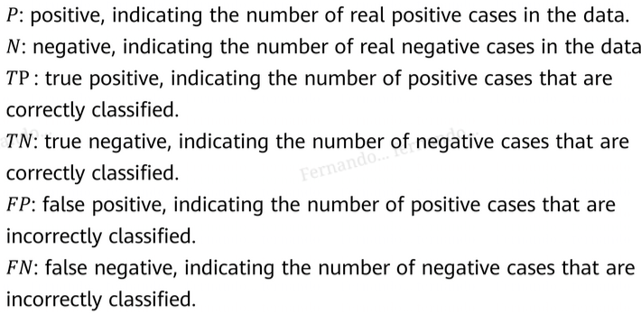

machine learning overview
===

# algorithms
we learn through experience
opposed to rule based
used for large scale and big complexity problems

we try to search unkwnown function f with training data. we will get function g similar to f

* classification: R^n -> 1, 2, ..., k
* regression: R^n -> R
* clustering: grouping unlabeled data

# types
* supervised (labeled data with supposed input/output)
* unsupervised (unlabeled data, used for clustering)
* semi-supervised
* reinforcement learning (interact with environment => receive its status and a reward, always look for the best action)

# process

* dataset: samples with features
* data cleansing
* data conversion
* feature selection
	- filter: get the best subset before hand => make a model
	- wrapper: make a model for each subset of the features, and get the one with the best performance. computationally expensive
	- embedded: get a subset => make a model => test performance & create a new subset => make a model => ...
* good models:
	- generalization (robustness)
	- explainability
	- speed
* under/overfitting
* variance & bias

You put numbers in each cell (the amount of cases that fall in each category)

# training methods
* gradient descent
* params and hyperparams
	- tuning methods (grid search, random search)
* cross-validation (divide into training, validation, test dataset)

# common algos
## regressions
* linear regression
* polynomial regression
	- regularization
	- ridge & lasso regression
* logistic regression

## decision tree

- purity
- split standard

## support vector machine (SVM)
draw a division line

- support vectors (closest points to the division line)
- kernel functions
	
## kNN

- doesn't use parameters, often used for irregular decision boundaries
- needs a lot of computing
	
## bayes probability

> The probability that data k (my unknown object) belongs to class C (apples), given that it has attributes Xi (round, red, 10 cm diam) is the following:

> The probability of an apple having all those attributes

> Multiplied by the probability of having apples

> Divided by the probability of having objects with all those attributes

## ensemble learning:

training a bunch of models: wisdom of the crowd

- bagging: make a bunch and average their predictions
- boosting: make a bunch and lower their biases
- random forest: make a bunch of decision trees
	+ gradient boosted decision tree: next tree learns from the last to minimize a loss function
	
for unsupervised:

- k-means clustering
- hierarchical clustering: root is a cluster of all the data, each leaf is a single data point, and from there it starts clustering up