Deep learning overwiew
===

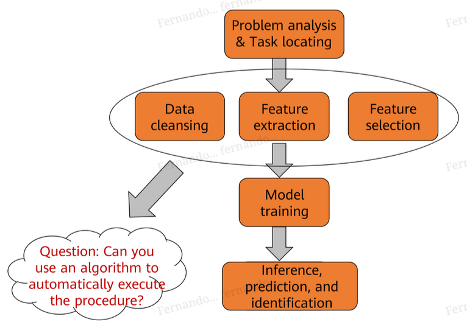

ANN: information processing system that imitates the human brain

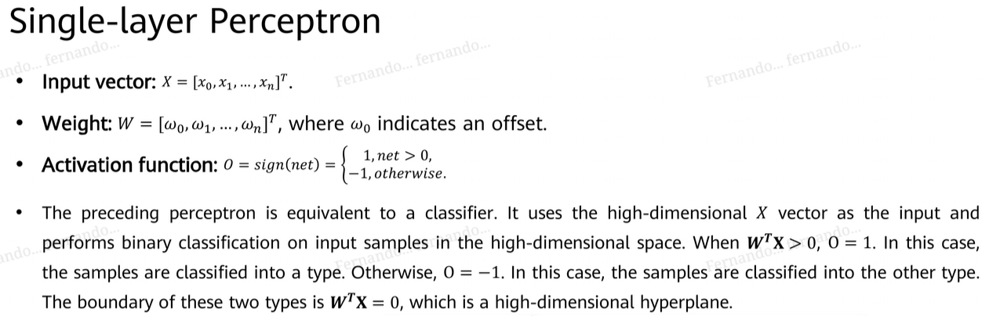

the XOR problem: solution:

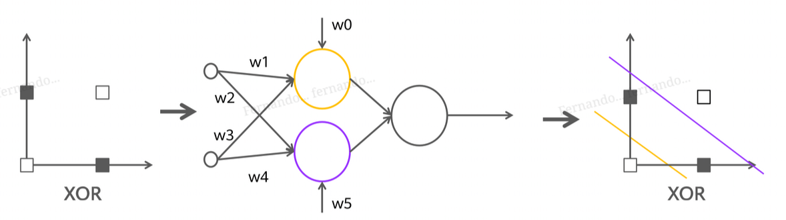

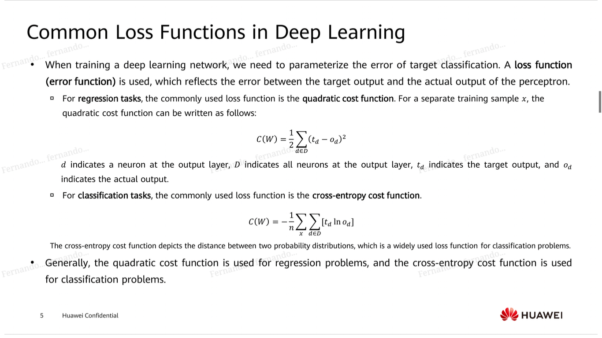

## batch gradient descent
calculate a global gradient descent per epoch, them decrement that to the weights

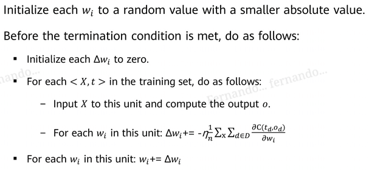

problem: we need to test all the dataset for every epoch

## stochastic gradient descent
just select a random one per epoch and update the weights for all based on that

## mini-batch gradient descent
take a small batch of all the dataset instead of only one

## forward and backward propagation

## problems we can have
* our gradient vanishes as we get more and more layers
* our gradient explodes as we get more and more layers

# activation functions

a function between outputs of a layer and the inputs to the next layer

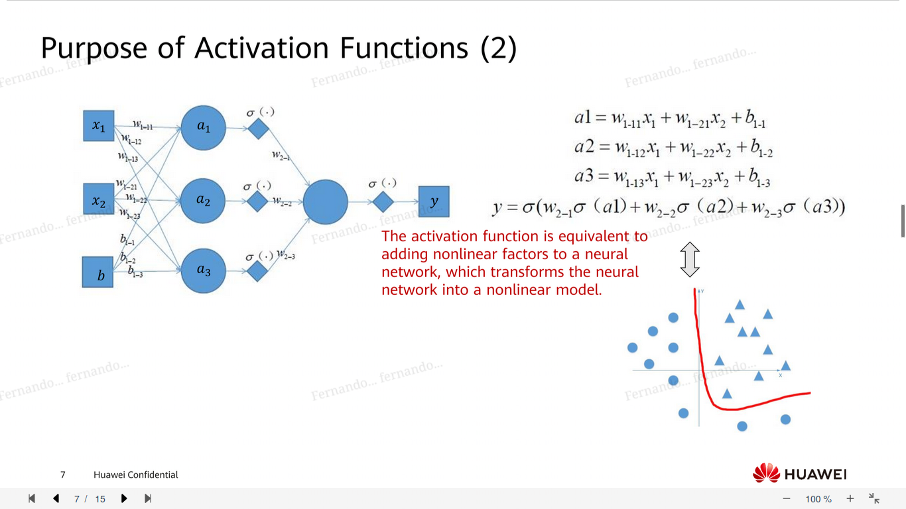

* sigmoid function

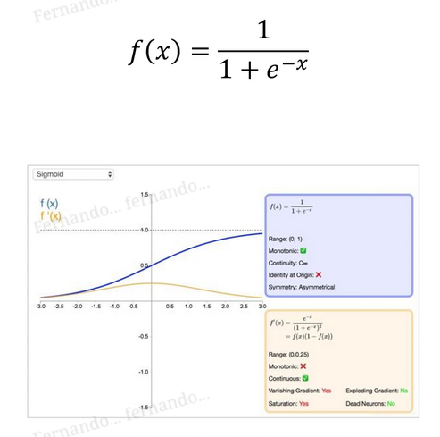

* tanh

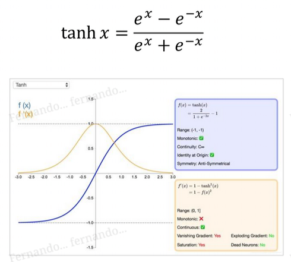

* softsign

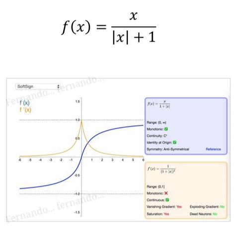

* rectified linear (ReLu)

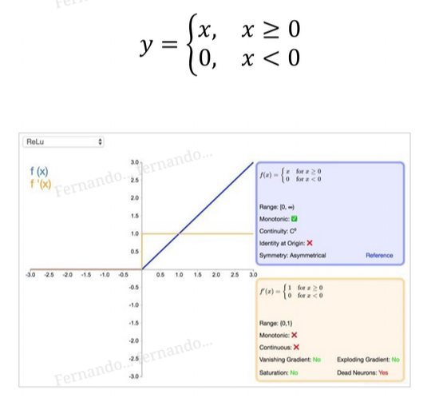

* leaky ReLu

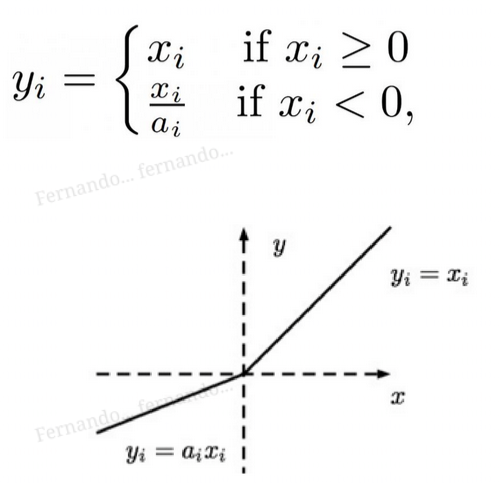

* softplus

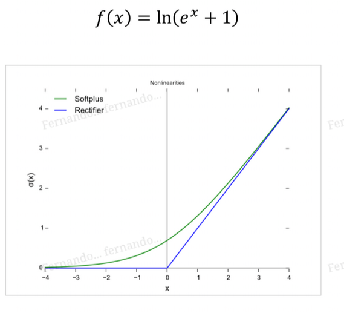

* softmax: used as the output layer function of a multiclass classification network

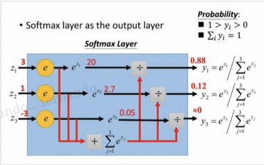

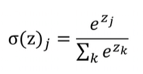

where `z` is the given vector of the layer right before

# normalization

aka fixing overfitting
* adding constraints
* expanding the training set: add noise?
* dropout
* early stopping

## parameter penalty

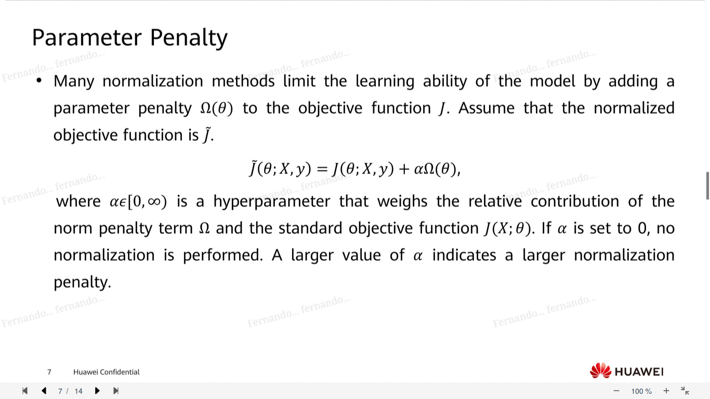

### L1 normalization

uses the concept of a vector norm

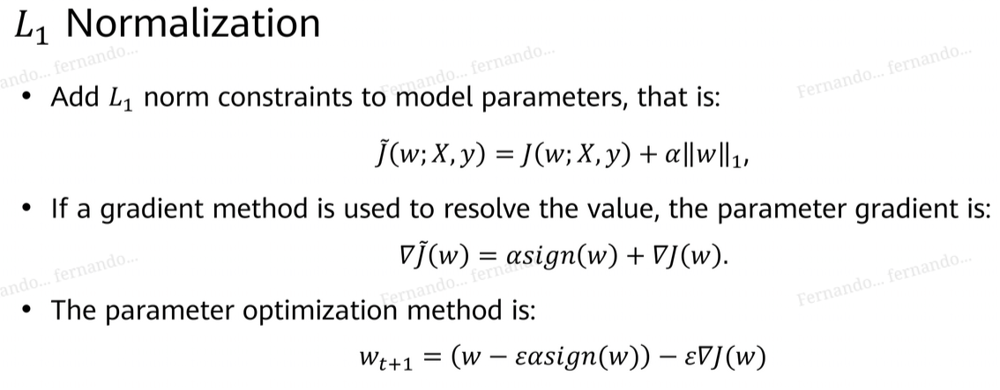

there's also L2 normalization that I didn't understand :ñ

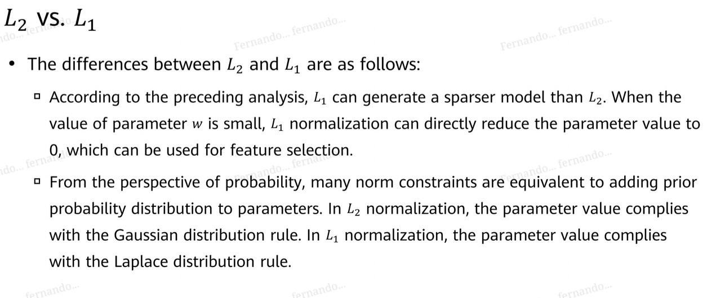

## data augmentation
aka expanding the dataset

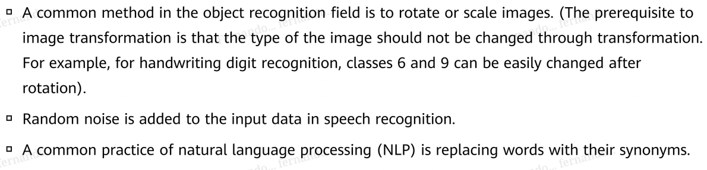

## early stopping
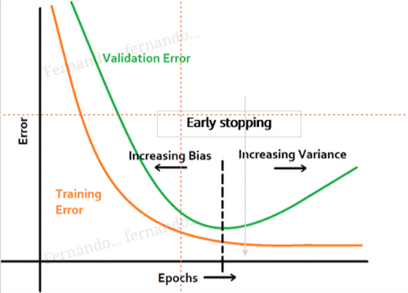

## dropout
randomly discard inputs in training. the parameters that handle those dropped inputs are not updated, just the others

# optimizers
different gradient descent algos

## momentum
imagine your machine learning surface. now imagine a ball rolls down that surface, but like in physics it has inertia.

## adagrad
set different learning rates to different parameters, and update them constantly

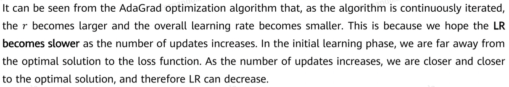

one problem we could have is that the learning starts to be really slow after some iterations

## rmsprop
improved adagrad that solves the problem of adagrad ending too early since the learning rate slows down

## adam (adaptive moment)
the momentum approach but setting the momentum coefficient as it keeps training

# neural network types

## CNNs (convolutional)
excels at image processing / pattern classification

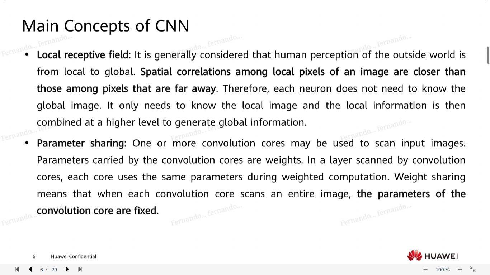

https://www.youtube.com/watch?v=QzY57FaENXg

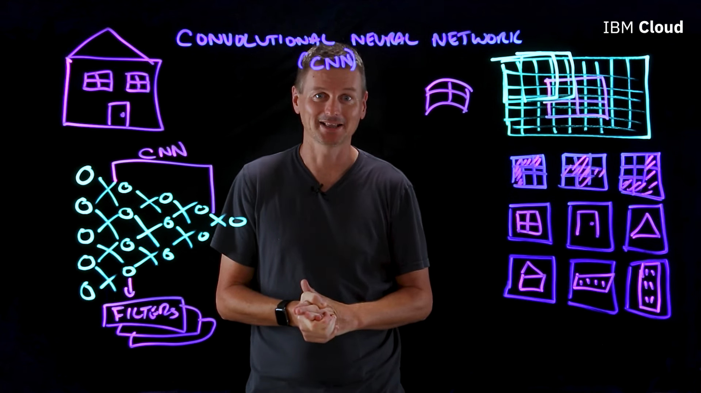

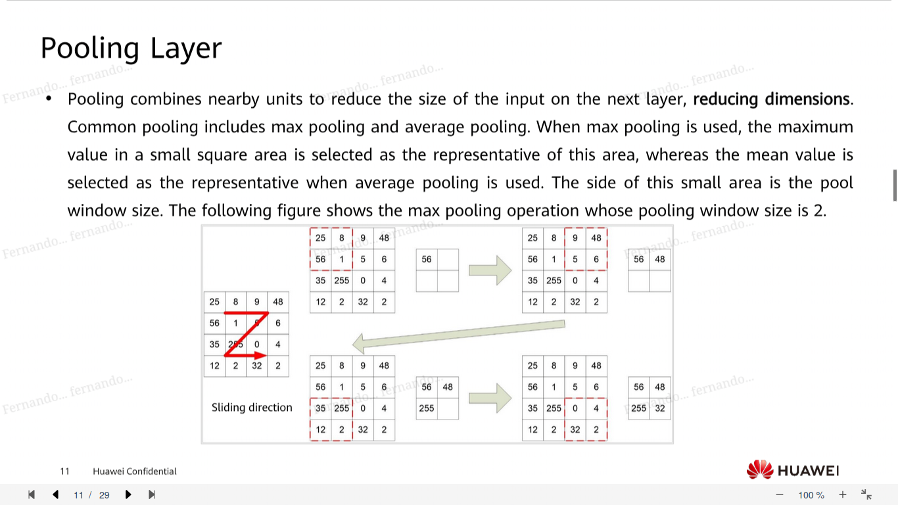

## RNNs (recurrent)

captures changing information in sequential data / over time (like in videos that have sequential frames over time). used in videos, audios made of clips, sentences made of words

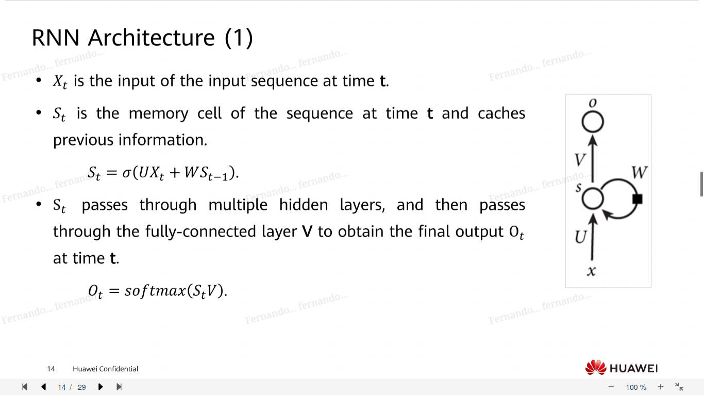

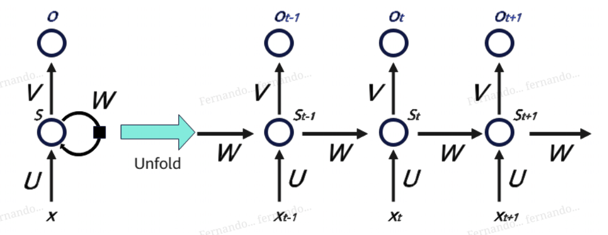

### backward propagation through time
use error both from the current output and the output right before that

### problems

## long short-term memory network (LSTM)

like an RNN, but:

1. has a forget gate: try to forget some previous information from the past
2. has an input gate: determine what information to keep in the memory cell, via creating a candidate vector
3. updates the state of the old cell
4. determines which part of the state will be the output
