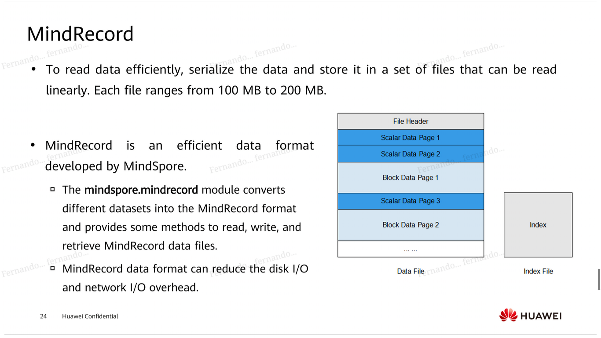
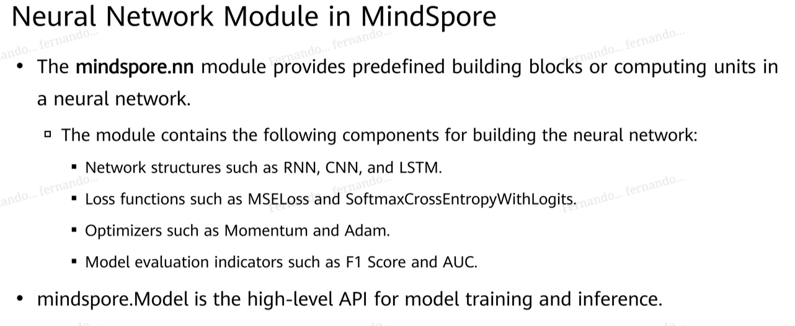
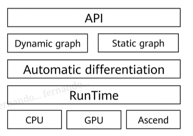
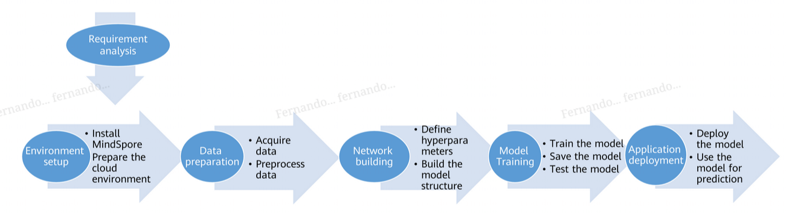

AI Development Frameworks
===

# PyTorch
By Facebook. Originally Torch (Lua), later PyTorch (Python).

Tensor library

Easier?

# Tensorflow
Supports more languages

## Tensorflow 2
* Keras

# Mindspore
Goal: to be all-encompassing

Callbacks that run while the training happens

## Static & dynamic graph
`set_context(mode=GRAPH_MODE)`: static
`set_context(mode=PYNATIVE_MODE)`: dynamic

normally working with static/dynamic involves different constraints. Mindspore uses a common API to handle both

## Heterogeneous parallel training
Send high memory subgraphs to CPU, less memory consuming ones to GPU

## Deployment process
Model file can be executed in cloud with Mindspore Serving, in devices with Mindspore Lite

### Mindspore Serving
Access through an API

### Mindspore Lite
Offline and online modules

### Mindinsight

### Mindspore Vision

### Mindspore Reinforcement
Used for training through reinforcement learning

### Mindspore Federated

# Dev process

