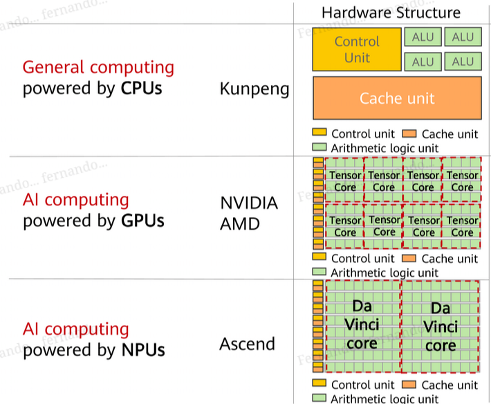
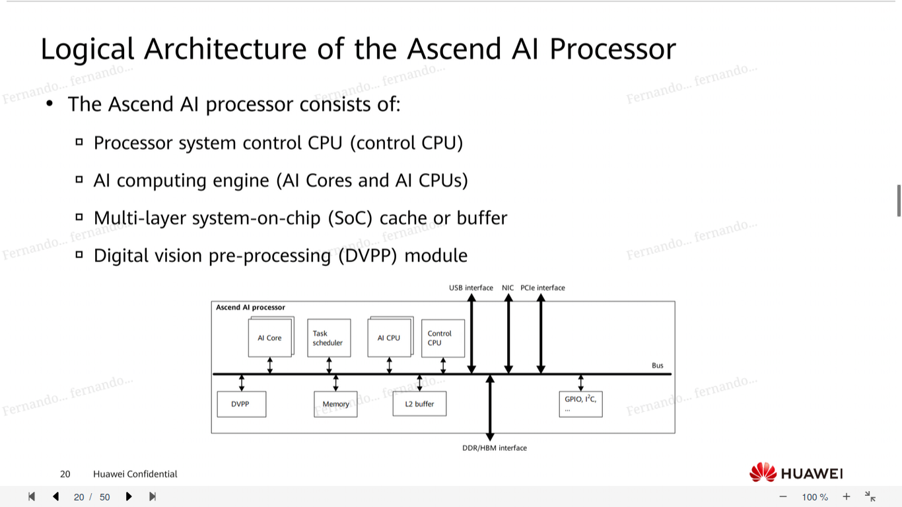
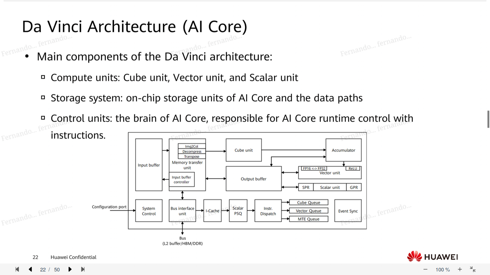
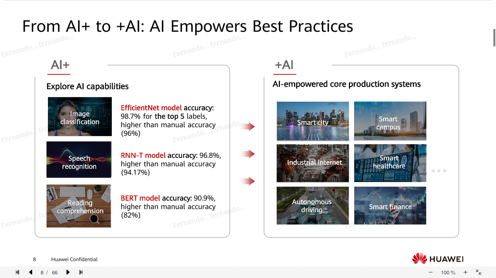
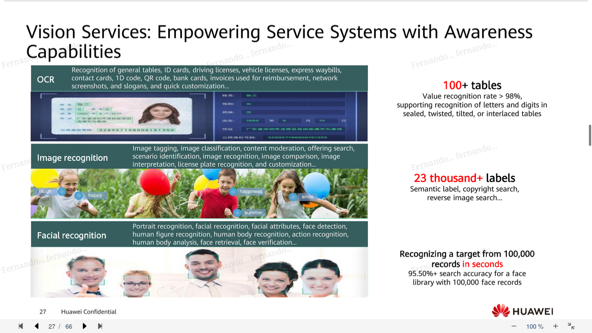
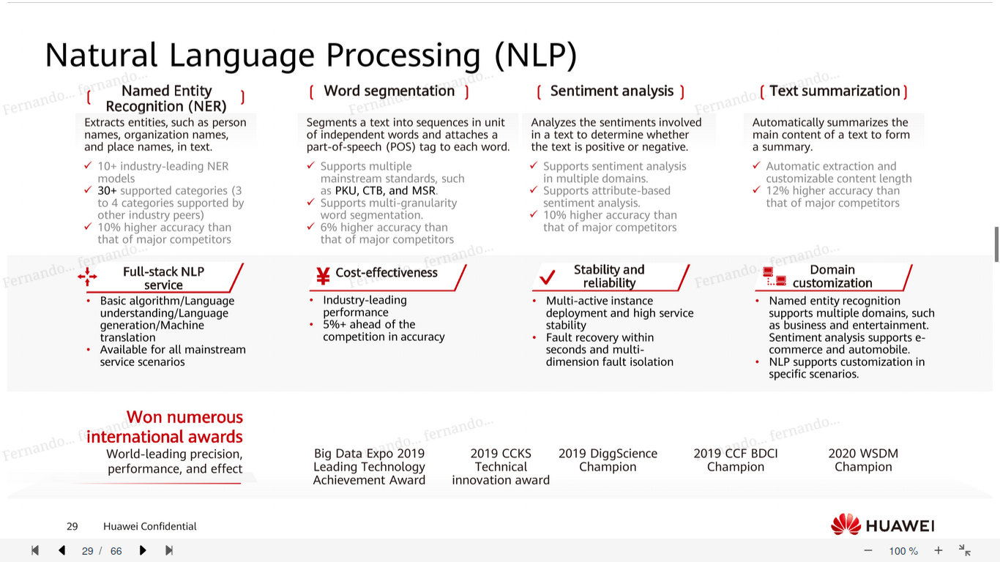

intro to huawei ai platforms
===
# ai processor
module dedicated to doing tasks pertaining to complex ai operations

* training and inference processors
* Da Vinci architecture
* GPUs, FPGAs (fully programmable units), ASICs

# ascend

modules made for multiplying matrices

parallel inputs

# cloud EI platform

* platform to label datasets and make a model

## services

# ai platforms

## HarmonyOS

## HMS Core

## ML Kit

## HiAI

## MindSpore Lite