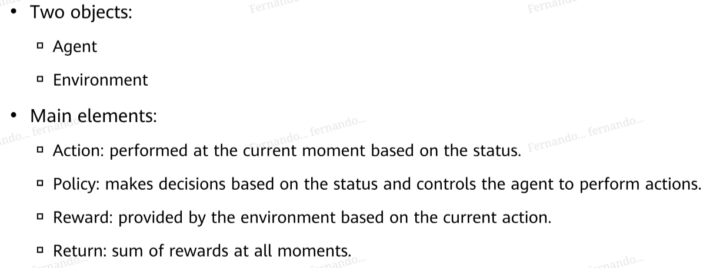
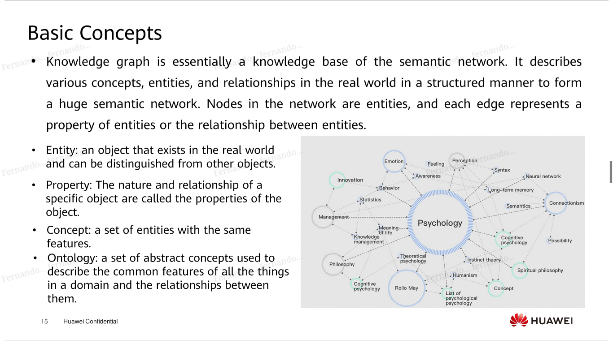
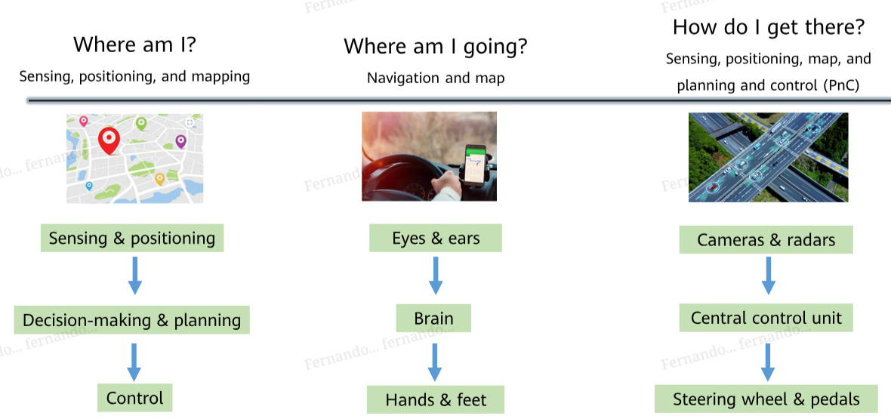
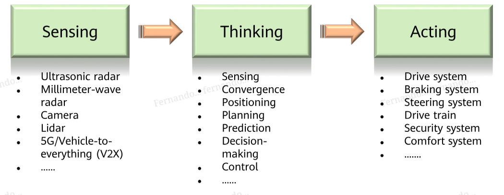

ai apps
===

# reinforcement learning
emphasize how to act based on the environment to maximize benefits

# GANs
competing game between Generator G and Discriminator D. G generates fake data, and D must tell if the data given is real or fake

# knowledge graph

# intelligent driving

