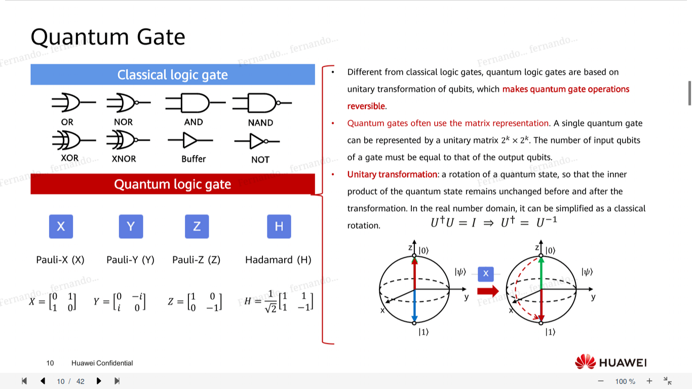

quantum computing
===
quantum: minimum amount of any physical entity

gates:
* pauli-x
* pauli-y
* pauli-z
* hadamard
* cnot
* measurement gate: get result

bell states: maximum entangled state of two qubits

algorithms:
*  shor: factor numbers
*  grover: linear search turned into O(sqrt(n))
*  hhl: solve linear equations

variational algorithm: instead of outputting exact result, it outputs probability distribution

VQE (variational quantum eigensolver): make a wavefunction that solves Schrodinger equation, useful in chemistry

Quantum Approximate Optimization: get an NP-hard algo and bring an approximate solution in P

advantages of using quantum:
* reduces time complexities
* good for linear algebra calculations